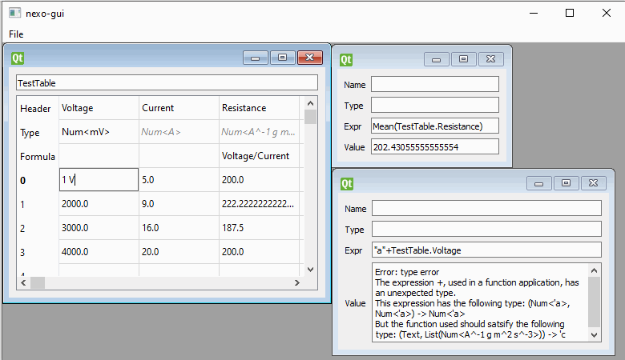

# Nexo

Nexo aims to be a new type of spreadsheet with an emphasis on ease of use, maintainability and correctness.
It combines strongly-typed values and first-class unit support with an array-based and functional formula language,
  making usage significantly more ergonomic than for a traditional spreadsheet environment.

**Warning:** Nexo is currently at the very earliest stages of development.
It is currently suitable only for the simplest of tasks, and all parts of the application have significant bugs.
Development is continuing.


## Screenshot



A brief summary of what each field currently means:

| Field name | Contents |
| --- | --- |
| Name | Name of value |
| Header | Name of table column |
| Type | Inferred (grey) or given (black) type of value |
| Expr | Expression in formula language yielding a single value (eg. `1+1` or `Mean([1,5,10])` or `If(1=1,10,20)`) |
| Formula | Expression in formula language yielding a list of values; can refer to other columns in same table |
| Value | Result of evaluating the Expr |

## Building and running Nexo

Nexo is built using Haskell and C++, with the Qt GUI library.
(The basic architecture is described [elsewhere](https://github.com/bradrn/brassica/blob/d6ebb3c933d6e6a88c725df4ffd1afe9e96c6829/ARCHITECTURE.md).)
To compile the Haskell code, run `stack build` or `cabal build nexo && cabal build nexo-interop`.
Then open `./gui/nexo-gui/CMakeLists.txt` in Qt Creator.
You should then be able to build and run the GUI like any other Qt program.
You can also run the interactive interpreter on the Haskell code alone by running `stack ghci nexo:lib` or `cabal repl lib:nexo`.

### Troubleshooting compiler errors

When building Nexo for the first time you might see the following error:

```
--  While building package regex-posix-0.96.0.0 (scroll up to its section to see the error) using:
      C:\sr\setup-exe-cache\x86_64-windows\Cabal-simple_Z6RU0evB_3.2.1.0_ghc-8.10.4.exe --builddir=.stack-work\dist\274b403a build --ghc-options " -fdiagnostics-color=always"
    Process exited with code: ExitFailure 1
```

This can be fixed by running the following commands, exactly as written and in order:

```
stack --resolver lts-18.1 exec -- ghc-pkg unregister regex-posix-0.96.0.0 --force
stack build regex-posix-0.96.0.0 --flag regex-posix:_regex-posix-clib --resolver lts-18.1
```

(The first command can sometimes give an error. This error is safe to ignore; simply continue on with the second command.)

After running the two commands above, commands such as `stack build` should complete successfully and without error.
